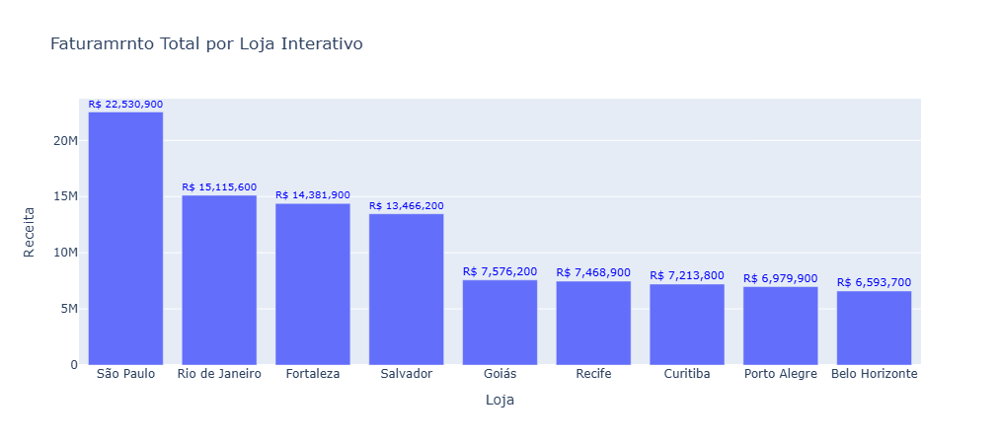
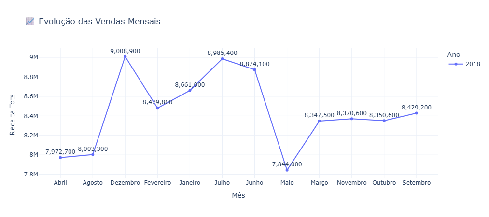
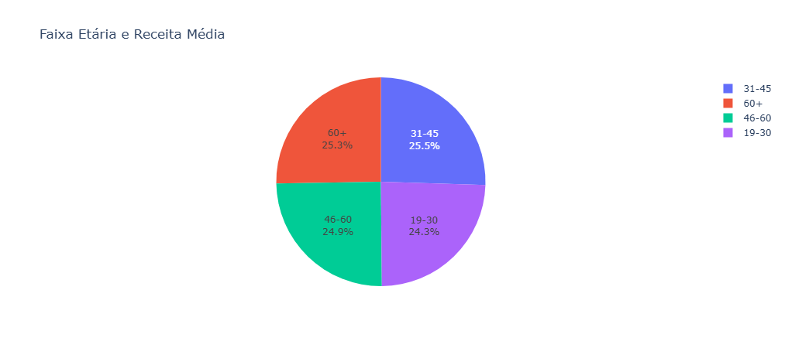
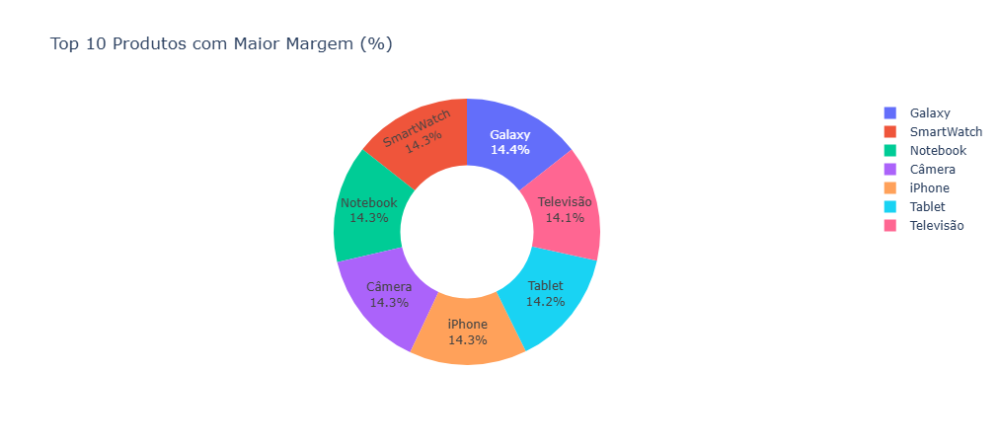

# 📊 Análise de Vendas — Projeto Completo em Python + Jupyter Notebook


Este projeto apresenta uma análise completa de dados de vendas utilizando **Python**, **Pandas**, **Matplotlib** e **Jupyter Notebook**, com foco em métricas essenciais para decisões estratégicas.  
O objetivo foi transformar uma base de dados bruta em **informações claras**, **gráficos prontos**, **indicadores de desempenho** e um **mini dashboard dentro do próprio notebook**.

O projeto segue uma linha semelhante ao que empresas de varejo e e-commerce aplicam no dia a dia para monitorar faturamento, lucratividade e comportamento de vendas.

---

<div align="center">
<table align="center">
<tr>
<td></td>
<td></td>
</tr>
<tr>
<td></td>
<td></td>
<tr>
<td></td>
</tr>
</table>

</div>
---


---

## 🎯 Objetivos do Projeto

- Processar um dataset de vendas com Python.
- Gerar métricas relevantes (faturamento, lucro, ticket médio, etc.).
- Criar gráficos profissionais usando Matplotlib.
- Construir um dashboard simples direto no Jupyter Notebook.
- Visualizar padrões e apoiar decisões estratégicas.
- Demonstrar domínio de bibliotecas de análise de dados.

---

## 🧠 O que foi feito na análise

### ✔️ 1. Carregamento e limpeza dos dados  
- Leitura da base de vendas em CSV/Excel.  
- Correção de tipos (datas, números, categorias).  
- Tratamento de valores ausentes e inconsistências.  
- Criação de colunas derivadas (lucro, margem, ano/mês, etc.).

### ✔️ 2. Exploração inicial (EDA – Exploratory Data Analysis)  
- Quantidade total de pedidos.  
- Número de lojas e produtos distintos.  
- Distribuição de vendas por período.  
- Comportamento de faturamento mensal.

### ✔️ 3. Construção das métricas principais  
As principais métricas calculadas foram:

- **Faturamento total**  
- **Lucro total**  
- **Margem por produto**  
- **Produtos mais vendidos**  
- **Top 10 produtos que mais geram lucro**  
- **Desempenho por loja**  
- **Sazonalidade mensal/anual**

### ✔️ 4. Criação dos gráficos  
Foram gerados gráficos salvos automaticamente em `.png`, incluindo:

- Faturamento por loja  
- Margem por produto  
- Top 10 produtos com maior lucro  
- Evolução das vendas mensais  

### ✔️ 5. Construção de um mini dashboard no Notebook  
Usando apenas:
```python
from IPython.display import Image, display

# Analise-de-Vendas_com-Pandas
# Analise-de-Vendas_com-Pandas
